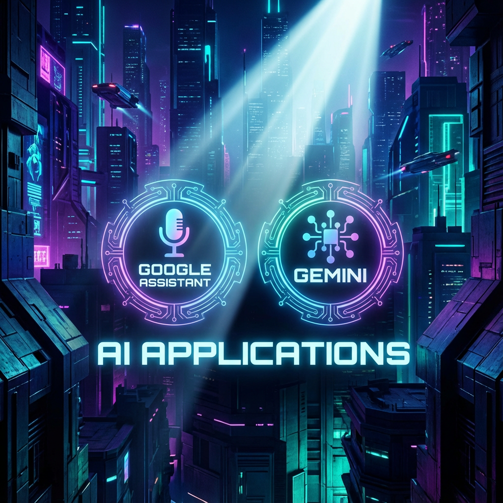

# AI Cover Generator

<p align="center">
  <strong>🎨 AI-Powered Cover Image Generator for Chinese Social Media Platforms</strong>
</p>

<p align="center">
  <a href="#features">Features</a> •
  <a href="#tech-stack">Tech Stack</a> •
  <a href="#quick-start">Quick Start</a> •
  <a href="#configuration">Configuration</a> •
  <a href="#project-structure">Structure</a>
</p>

---

## Overview

AI Cover Generator is a modern web application that leverages AI to create stunning, platform-optimized cover images for Chinese social media platforms including **Xiaohongshu (小红书)**, **WeChat (微信公众号)**, **Taobao (淘宝)**, and **Douyin (抖音)**.

Simply input your content, and the AI pipeline will analyze your text, generate compelling titles, and create professional cover images tailored to each platform's specifications.

## Features

- 🤖 **AI-Powered Pipeline** - Multi-stage AI agents for text analysis, title generation, and image creation
- 🎯 **Platform Optimization** - Auto-sized covers for Xiaohongshu, WeChat, Taobao, and Douyin
- 🎨 **Multiple AI Models** - Support for DALL-E, GPT-4o Image, Gemini, Flux, and more
- 🖼️ **Visual Style Templates** - 6 built-in professional design styles
- ✏️ **Canvas Editor** - Fabric.js-powered editor for text positioning and customization
- 💾 **Flexible Storage** - Local development storage or Cloudflare R2 for production
- ⚡ **Modern Stack** - Built with Next.js 14, TypeScript, and Tailwind CSS

## Tech Stack

| Category | Technologies |
|----------|-------------|
| **Framework** | Next.js 14 (App Router), React 18, TypeScript 5.7 |
| **AI Providers** | OpenAI, Google Gemini, Replicate, Zhipu AI, Volcengine |
| **Canvas** | Fabric.js 6 |
| **Storage** | Local FS / Cloudflare R2 (via AWS S3 SDK) |
| **UI** | Tailwind CSS, shadcn/ui, Framer Motion |
| **Database** | Prisma + PostgreSQL (Supabase) |

## Quick Start

### Prerequisites

- Node.js 18+
- npm or pnpm
- At least one AI provider API key

### Installation

```bash
# Clone the repository
git clone https://github.com/147qaz258-ead/Cover.git
cd Cover

# Install dependencies
npm install

# Copy environment template
cp .env.local.example .env.local

# Configure your API keys in .env.local
# Then start development server
npm run dev
```

Visit `http://localhost:3000` to see the application.

## Configuration

Copy `.env.local.example` to `.env.local` and configure the following:

### Required API Keys (at least one)

```bash
# OpenAI (DALL-E, GPT-4o)
OPENAI_API_KEY=your_key

# Google Gemini
GOOGLE_AI_API_KEY=your_key

# Laozhang API (recommended for China access)
LAOZHANG_API_KEY=your_key
```

### LLM Provider for Text Analysis

```bash
# Options: volcengine_deepseek_v32, zhipu_glm46, gemini_flash, openai_gpt4o
LLM_PROVIDER=volcengine_deepseek_v32

# Corresponding API key
VOLCENGINE_API_KEY=your_key
# or
ZHIPUAI_API_KEY=your_key
```

### Storage Mode

```bash
# Development: local file storage
STORAGE_MODE=local

# Production: Cloudflare R2
STORAGE_MODE=r2
CLOUDFLARE_R2_ACCESS_KEY=...
CLOUDFLARE_R2_SECRET_KEY=...
```

See `.env.local.example` for the complete configuration reference.

## Project Structure

```
src/
├── app/                    # Next.js App Router
│   ├── (dashboard)/        # Dashboard routes
│   │   ├── generate/       # Main generation page
│   │   └── results/        # Results display
│   └── api/                # API endpoints
├── components/
│   ├── ui/                 # shadcn/ui components
│   ├── forms/              # Form components
│   └── covers/             # Cover generation components
├── lib/
│   ├── ai/                 # AI pipeline & providers
│   │   ├── agents/         # AI agents
│   │   ├── providers/      # Model providers
│   │   └── prompts/        # LLM prompts
│   ├── canvas/             # Fabric.js managers
│   ├── storage/            # Storage drivers
│   └── platforms/          # Platform specifications
└── types/                  # TypeScript definitions
```

## Sample Covers

Here are some AI-generated cover examples for Xiaohongshu (小红书):

<p align="center">
  
  
  
</p>

More samples are available in the `.local-storage/covers/` directory, organized by platform.

## Development Commands

```bash
npm run dev          # Start dev server
npm run build        # Production build
npm run lint         # ESLint
npm run type-check   # TypeScript check
```

## API Endpoints

| Endpoint | Method | Description |
|----------|--------|-------------|
| `/api/generate` | POST | Start cover generation job |
| `/api/generate/[jobId]` | GET | Poll job status |
| `/api/models` | GET | List available AI models |
| `/api/visual-styles` | GET | Get visual style templates |

## License

MIT License - see [LICENSE](LICENSE) for details.

---

<p align="center">
  Made with ❤️ for content creators
</p>
