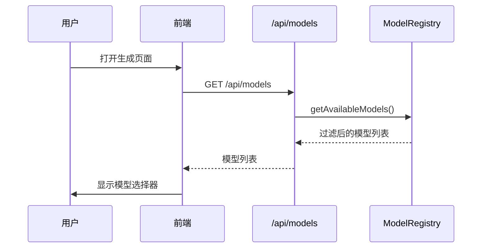
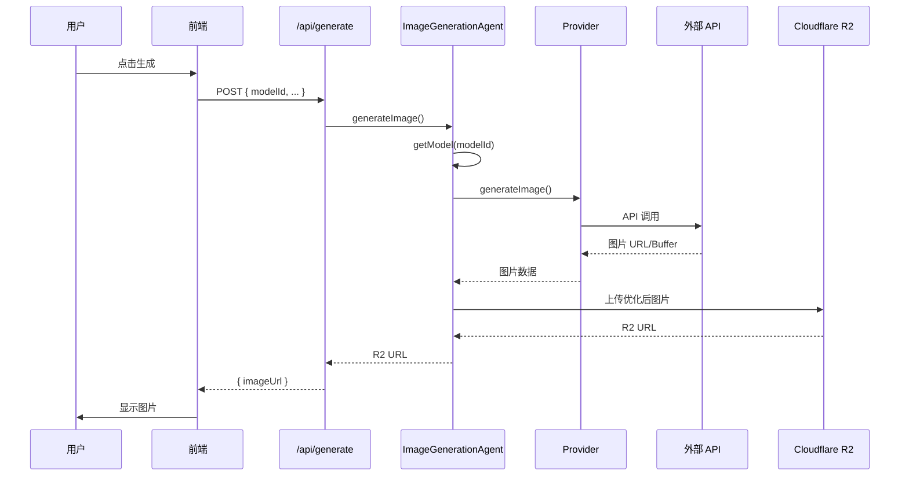

# 图像生成功能架构文档

> **版本**: 1.3
> **最后更新**: 2025-12-23
> **状态**: Active

---

## ⚠️ 核心命名规范

> **此规范是强制性的，所有代码和文档必须遵守。**

### 模型命名映射表

根据 **Google 官方命名**，本项目对 AI 模型采用以下命名规则：

| 官方名称 | 模型 ID | 类型 | 前端显示名称 |
|----------|---------|------|--------------|
| **Nano Banana Pro** | `gemini-3-pro-image-preview` | 图像模型 | `Nano Banana Pro` |
| **Nano Banana** | `gemini-2.5-flash-image` | 图像模型 | `Nano Banana` |
| Gemini 3 Pro Preview | `gemini-3-pro-preview` | 语言模型 | （底层使用，不显示） |
| Gemini 3 Flash Preview | `gemini-3-flash-preview` | 语言模型 | （底层使用，不显示） |
| Gemini 2.5 Flash | `gemini-2.5-flash` | 语言模型 | （底层使用，不显示） |

### 命名规则

1. **图像模型**（按次计费）→ 使用 `Nano Banana` 系列命名
   - 用户可见，开放给 ModelSelector 选择
   - 前端显示: `Nano Banana Pro`, `Nano Banana`
   
2. **语言模型**（按 Token 计费）→ 使用 `Gemini` 系列命名
   - 底层使用，不开放给用户
   - 前端不显示

### 代码示例

```typescript
// ✅ 正确：图像模型使用 Nano Banana 命名
{
  id: "google/gemini-3-pro-image-preview",
  name: "Nano Banana Pro",  // 前端显示
  // ...
}

// ✅ 正确：语言模型使用 Gemini 命名（底层使用）
const textModel = "gemini-2.5-flash";
```

---

## 目录

1. [功能概述](#1-功能概述)
2. [架构总览](#2-架构总览)
3. [模型配置层](#3-模型配置层)
4. [Provider 层](#4-provider-层)
5. [Agent 层](#5-agent-层)
6. [API 层](#6-api-层)
7. [前端层](#7-前端层)
8. [数据流](#8-数据流)
9. [扩展指南](#9-扩展指南)
10. [配置参考](#10-配置参考)

---

## 1. 功能概述


### 1.1 核心能力

- **多模型支持**: 10+ 图像生成模型，覆盖 Gemini、Flux、DALL-E、Stable Diffusion
- **多渠道接入**: 同一模型可通过官方/中转站多渠道调用
- **自动降级**: 失败时自动重试并降级到备选模型
- **配置驱动**: 添加新模型无需修改业务代码

### 1.2 模型分类

> ⚠️ **重要区分**：项目中使用两种类型的 AI 模型，它们的用途和计费方式完全不同。

| 类型 | 计费方式 | 用途 | 用户可选 |
|------|----------|------|----------|
| **图像模型** | 按次计费 (`$/次`) | 生成封面图片 | ✅ 开放给用户选择 |
| **语言模型** | 按 Token 计费 (`$/1M tokens`) | 文本分析、标题生成 | ❌ 底层使用，不开放 |

**语言模型**（如 `gemini-2.5-flash`）用于：
- 文本分析 (`TextAnalyzer`)
- 标题生成 (`TitleGenerator`)
- 系统默认使用 Gemini 官方免费配额

**图像模型**（如 `gemini-3-pro-image-preview`）用于：
- 封面图片生成 (`ImageGenerationAgent`)
- 用户可通过 `ModelSelector` 选择

### 1.3 图像生成模型（用户可选）

#### 老张 API 中转（推荐，国内直连）

> 数据来源: [老张 API 定价](https://api.laozhang.ai/account/pricing) (2025-12-23)

| 模型 ID | 显示名称 | 价格 | 特点 |
|---------|----------|------|------|
| `gemini-3-pro-image-preview` | Nano Banana Pro | $0.0500/次 | 4K 分辨率，默认推荐 |
| `gemini-2.5-flash-image` | Nano Banana | $0.0250/次 | 快速生成，性价比高 |
| `gpt-4o-image` | GPT-4o Image | $0.0100/次 | 价格最低，质量不错 |
| `flux-kontext-pro` | Flux Kontext Pro | ~$0.0350/次 | 灵活宽高比，艺术感强 |
| `flux-kontext-max` | Flux Kontext Max | ~$0.0700/次 | 最高质量 |

#### 官方 API

| 渠道 | 模型 | 价格 | 备注 |
|------|------|------|------|
| Google | Nano Banana Pro (`gemini-3-pro-image-preview`) | 免费（有配额限制） | 429 速率限制频繁 |
| Google | Nano Banana (`gemini-2.5-flash-image`) | 免费（有配额限制） | |
| OpenAI | `dall-e-3` | $0.0400/次 | 官方 DALL-E |
| OpenAI | `dall-e-2` | $0.0200/次 | |
| Replicate | `stable-diffusion` | 按量计费 | 开源模型 |

### 1.4 语言模型（底层使用）

> 这些模型**不开放给用户选择**，仅在后端自动调用。

| 用途 | 使用的模型 | 计费方式 | 配置建议 |
|------|-----------|----------|----------|
| 文本分析 | `gemini-2.5-flash` | $0.30/1M tokens | 官方免费配额优先 |
| 标题生成 | `gemini-2.5-flash` | $0.30/1M tokens | 官方免费配额优先 |

**配置策略**：
- 优先使用 **Google 官方 API**（免费配额）用于语言模型
- 如果官方配额耗尽，自动切换到 **老张 API 中转**

### 1.5 模型选择策略

系统按照优先级（Priority）顺序尝试使用图像模型。

**当前优先级配置**：

1. **Laozhang/Gemini 3 Pro** `priority: 0` (首选)
   - 优势：性价比、速度快、无配额烦恼
2. **Laozhang/Flux Kontext Pro** `priority: 1` (备选)
   - 优势：生成质量极高，艺术感强
3. **Laozhang/GPT-4o Image** `priority: 2`
   - 优势：价格最低
4. **Laozhang/Flux Kontext Max** `priority: 3`
   - 优势：最高质量
5. **Google/Gemini 3 Pro** `priority: 5`
   - 注意：免费但有严格速率限制

### 1.6 异常处理与重试

- **自动重试**: 对网络超时等临时错误自动重试 3 次（指数退避）
- **自动降级 (Fallback)**: 如果模型调用失败，自动尝试下一优先级的模型
  - 示例: Gemini 3 Pro (429) → Flux Kontext Pro (Success)

## 2. 架构总览

### 2.1 分层架构图

```
┌─────────────────────────────────────────────────────────────────┐
│                         前端层 (Frontend)                        │
│  ┌─────────────────┐  ┌─────────────────┐  ┌─────────────────┐  │
│  │  ModelSelector  │  │  GenerateForm   │  │    Preview      │  │
│  └────────┬────────┘  └────────┬────────┘  └─────────────────┘  │
│           │                    │                                 │
└───────────┼────────────────────┼─────────────────────────────────┘
            │                    │
            ▼                    ▼
┌─────────────────────────────────────────────────────────────────┐
│                          API 层 (Next.js)                        │
│  ┌─────────────────┐  ┌─────────────────────────────────────┐   │
│  │  /api/models    │  │        /api/generate                │   │
│  │  GET 模型列表   │  │     POST 生成图像                   │   │
│  └────────┬────────┘  └────────────────┬────────────────────┘   │
└───────────┼────────────────────────────┼────────────────────────┘
            │                            │
            ▼                            ▼
┌─────────────────────────────────────────────────────────────────┐
│                         Agent 层 (业务逻辑)                       │
│  ┌──────────────────────────────────────────────────────────┐   │
│  │                  ImageGenerationAgent                     │   │
│  │  - generateImage()      主入口                            │   │
│  │  - generateWithFallback() 重试+降级                       │   │
│  │  - generateWithModel()  调用 Provider                     │   │
│  │  - saveImageToR2()      保存到存储                        │   │
│  └────────────────────────────┬─────────────────────────────┘   │
└───────────────────────────────┼─────────────────────────────────┘
                                │
                                ▼
┌─────────────────────────────────────────────────────────────────┐
│                       Provider 层 (AI 适配)                       │
│  ┌─────────────────┐ ┌─────────────────┐ ┌─────────────────┐    │
│  │  OpenAIProvider │ │GeminiImageProv. │ │ReplicateProvider│    │
│  │  (支持 baseURL) │ │ (@google/genai) │ │                 │    │
│  └────────┬────────┘ └────────┬────────┘ └────────┬────────┘    │
└───────────┼───────────────────┼───────────────────┼─────────────┘
            │                   │                   │
            ▼                   ▼                   ▼
┌─────────────────────────────────────────────────────────────────┐
│                         外部 API 层                              │
│  ┌─────────────────┐ ┌─────────────────┐ ┌─────────────────┐    │
│  │   老张 API      │ │  Google AI API  │ │  Replicate API  │    │
│  │   OpenAI API    │ │                 │ │                 │    │
│  └─────────────────┘ └─────────────────┘ └─────────────────┘    │
└─────────────────────────────────────────────────────────────────┘
                                │
                                ▼
┌─────────────────────────────────────────────────────────────────┐
│                        存储层 (Cloudflare R2)                     │
└─────────────────────────────────────────────────────────────────┘
```

### 2.2 文件结构

```
src/lib/ai/
├── config/                          # 模型配置层
│   ├── model-config.ts              # 类型定义
│   ├── image-models.ts              # 模型配置列表
│   └── index.ts                     # ModelRegistry
├── providers/                       # Provider 层
│   ├── openai.ts                    # OpenAI 兼容 Provider
│   ├── gemini-image.ts              # Gemini 图像 Provider
│   ├── replicate.ts                 # Replicate Provider
│   └── index.ts                     # 统一导出
└── agents/                          # Agent 层
    └── image-generator.ts           # 图像生成 Agent
```

---

## 3. 模型配置层

### 3.1 核心类型定义

**文件**: `src/lib/ai/config/model-config.ts`

```typescript
// Provider 类型
type ImageProviderType = "openai-compatible" | "gemini" | "replicate";

// 模型配置接口
interface ImageModelConfig {
  id: string;                    // 唯一标识: "provider/model-name"
  name: string;                  // 显示名称
  provider: ImageProviderType;   // Provider 类型
  endpoint: {
    baseURL: string;             // API 端点
    apiKeyEnv: string;           // 环境变量名
  };
  model: string;                 // 传给 API 的模型名
  capabilities: {
    aspectRatios?: string[];     // 支持的宽高比
    sizes?: string[];            // 支持的尺寸
    maxResolution?: "1K"|"2K"|"4K";
  };
  extraParams?: Record<string, unknown>;  // extra_body 参数
  pricing?: { perImage: number; currency: string };
  priority: number;              // 优先级 (越小越高)
  isDefault?: boolean;           // 是否默认
  fallbackTo?: string;           // 降级目标模型 ID
}

// 模型注册表接口
interface ModelRegistry {
  getModel(id: string): ImageModelConfig | undefined;
  getDefaultModel(): ImageModelConfig;
  getAvailableModels(): ImageModelConfig[];
}
```

### 3.2 模型配置列表

**文件**: `src/lib/ai/config/image-models.ts`

```typescript
export const IMAGE_MODELS: ImageModelConfig[] = [
  // 老张 API 模型
  { id: "laozhang/flux-kontext-pro", ... },
  { id: "laozhang/gpt-4o-image", ... },
  { id: "laozhang/gemini-3-pro-image-preview", ... },
  
  // Google Gemini 官方
  { id: "google/gemini-3-pro-image-preview", isDefault: true, ... },
  
  // OpenAI 官方
  { id: "openai/dall-e-3", ... },
  
  // Replicate
  { id: "replicate/stable-diffusion", ... },
];
```

### 3.3 注册表实现

**文件**: `src/lib/ai/config/index.ts`

```typescript
// 单例注册表
export function getModelRegistry(): ModelRegistry {
  // 根据环境变量过滤可用模型
  // 返回按 priority 排序的模型列表
}

// 转换为公开信息（过滤敏感字段）
export function toPublicModelInfo(config: ImageModelConfig): PublicModelInfo;
```

### 3.4 模型与环境变量映射

| 模型前缀 | 环境变量 | Provider 类型 |
|----------|----------|---------------|
| `laozhang/*` | `LAOZHANG_API_KEY` | openai-compatible |
| `google/*` | `GOOGLE_AI_API_KEY` | gemini |
| `openai/*` | `OPENAI_API_KEY` | openai-compatible |
| `replicate/*` | `REPLICATE_API_TOKEN` | replicate |

---

## 4. Provider 层

### 4.1 OpenAI Provider

**文件**: `src/lib/ai/providers/openai.ts`

```typescript
class OpenAIProvider {
  constructor(apiKey: string, baseURL?: string);
  
  async generateImage(prompt: string, options?: {
    model?: string;
    size?: string;
    aspectRatio?: string;       // Flux 模型
    extraBody?: Record<string, unknown>;
  }): Promise<string>;          // 返回图片 URL
}

// 工厂函数
export function createOpenAICompatibleProvider(
  apiKey: string,
  baseURL: string
): OpenAIProvider;
```

**支持的模型**:
- 官方 OpenAI: DALL-E 2/3
- 老张 API: Flux, GPT-4o-Image, Gemini (通过兼容接口)

### 4.2 Gemini Image Provider

**文件**: `src/lib/ai/providers/gemini-image.ts`

```typescript
class GeminiImageProvider {
  constructor(apiKey: string);
  
  async generateImage(prompt: string, options?: {
    model?: string;             // gemini-3-pro-image-preview
    aspectRatio?: string;
    imageSize?: "1K"|"2K"|"4K"; // 仅 Pro 支持
  }): Promise<Buffer>;          // 返回图片 Buffer
}
```

**SDK**: 使用 `@google/genai` (非 `@google/generative-ai`)

### 4.3 Replicate Provider

**文件**: `src/lib/ai/providers/replicate.ts`

```typescript
class ReplicateProvider {
  async generateImage(prompt: string, options?: {
    width?: number;
    height?: number;
    num_inference_steps?: number;
    guidance_scale?: number;
  }): Promise<string[]>;        // 返回图片 URL 数组
}
```

---

## 5. Agent 层

### 5.1 ImageGenerationAgent

**文件**: `src/lib/ai/agents/image-generator.ts`

```typescript
class ImageGenerationAgent {
  // 主入口
  async generateImage(request: {
    title: string;
    platform: Platform;
    template: StyleTemplate;
    modelId?: string;           // 可选指定模型
    customizations?: { ... };
  }): Promise<string>;          // 返回 R2 URL

  // 获取可用模型 (供 API 使用)
  getAvailableModels(): PublicModelInfo[];
}
```

### 5.2 重试与降级机制

```typescript
private async generateWithFallback(
  prompt: string,
  config: ImageModelConfig,
  request: ImageGenerationRequest,
  attempt: number = 1
): Promise<string | Buffer> {
  try {
    return await this.generateWithModel(prompt, config, request);
  } catch (error) {
    // 重试逻辑: 最多 3 次，指数退避 1s → 2s → 4s
    if (attempt < MAX_RETRIES) {
      await delay(1000 * Math.pow(2, attempt - 1));
      return this.generateWithFallback(prompt, config, request, attempt + 1);
    }
    
    // 降级逻辑: 使用 fallbackTo 模型
    if (config.fallbackTo) {
      const fallback = this.registry.getModel(config.fallbackTo);
      return this.generateWithFallback(prompt, fallback, request, 1);
    }
    
    throw error;
  }
}
```

### 5.3 降级链配置

```
gemini-3-pro-image-preview (默认)
         ↓ 失败
laozhang/flux-kontext-pro
         ↓ 失败
openai/dall-e-3
         ↓ 失败
抛出错误
```

---

## 6. API 层

### 6.1 模型列表 API

**文件**: `src/app/api/models/route.ts`

```typescript
// GET /api/models
// 返回当前可用的图像模型列表

Response: {
  success: true,
  data: [
    {
      id: "google/gemini-3-pro-image-preview",
      name: "Gemini 3 Pro Image",
      provider: "gemini",
      capabilities: { aspectRatios: ["1:1", "16:9", ...] },
      priority: 5,
      isDefault: true,
      pricing: { perImage: 0.05, currency: "USD" }
    },
    ...
  ]
}
```

### 6.2 图像生成 API

**文件**: `src/app/api/generate/route.ts`

```typescript
// POST /api/generate
// 生成封面图像

Request: {
  text: string;              // 用户输入的文本内容
  platforms: string[];       // 目标平台 ID 列表
  styleTemplate: string;     // 风格模板 ID
  modelId?: string;          // 可选指定图像生成模型（来自 ModelSelector）
  customizations?: {         // 可选自定义样式
    backgroundColor?: string;
    textColor?: string;
    fontFamily?: string;
  };
}

Response: {
  success: true,
  data: {
    jobId: "uuid"            // 异步任务 ID
  }
}
```

---

## 7. 前端层

### 7.1 ModelSelector 组件

**文件**: `src/components/forms/model-selector.tsx`

**状态**: ✅ 已实现并集成

```tsx
interface ModelSelectorProps {
  value?: string;                      // 当前选中的模型 ID
  onChange: (modelId: string) => void; // 选中变化回调
  disabled?: boolean;                  // 是否禁用
  className?: string;                  // 自定义样式
}

export function ModelSelector({ value, onChange, disabled, className }: ModelSelectorProps) {
  // 从 /api/models 获取可用模型列表
  // 自动选择默认模型（isDefault: true）
  // 渲染 Select 下拉框，显示模型名称、Provider 标签、价格
  // 标记推荐模型
}
```

**功能特性**:
- 自动从 `/api/models` 获取可用模型
- 加载状态和错误状态处理
- 自动选择默认模型
- 显示 Provider 颜色徽章（OpenAI/Gemini/Replicate）
- 显示单次生成价格

### 7.2 CoverGenerator 集成

**文件**: `src/components/covers/cover-generator.tsx`

**状态**: ✅ 已集成 ModelSelector

```tsx
function CoverGenerator({ onComplete, showInfiniteCanvas }: CoverGeneratorProps) {
  const [selectedModelId, setSelectedModelId] = useState<string | undefined>();
  
  const handleGenerate = async () => {
    const request: CoverGenerationRequest = {
      text: text.trim(),
      platforms: selectedPlatforms,
      styleTemplate: selectedStyle,
      modelId: selectedModelId,  // ← 传递用户选择的模型
    };
    // ...
  };
  
  return (
    <>
      {/* 模型选择器 - 位于风格选择器上方 */}
      <div className="space-y-2">
        <label className="text-sm font-medium">图像生成模型</label>
        <ModelSelector
          value={selectedModelId}
          onChange={setSelectedModelId}
          disabled={false}
        />
      </div>
      
      {/* 其他表单组件 */}
      <StyleSelector ... />
      <PlatformSelector ... />
    </>
  );
}
```

**UI 布局**:
- 桌面端：右侧边栏，模型选择器 → 风格选择器 → 平台选择器 → 生成按钮
- 移动端：可折叠侧边栏，同样的排列顺序

---

## 8. 数据流

### 8.1 模型选择流程



### 8.2 图像生成流程



---

## 9. 扩展指南

### 9.1 添加新模型

**步骤 1**: 在 `image-models.ts` 添加配置

```typescript
{
  id: "provider/new-model",
  name: "新模型显示名",
  provider: "openai-compatible",  // 或 "gemini", "replicate"
  endpoint: {
    baseURL: "https://api.example.com/v1",
    apiKeyEnv: "NEW_API_KEY",
  },
  model: "actual-model-id",
  capabilities: {
    aspectRatios: ["1:1", "16:9"],
  },
  pricing: { perImage: 0.03, currency: "USD" },
  priority: 8,
  fallbackTo: "openai/dall-e-3",
}
```

**步骤 2**: 在 `.env.local` 添加环境变量

```bash
NEW_API_KEY=your_key_here
```

**步骤 3**: 重启服务验证

```bash
curl http://localhost:3000/api/models | jq
```

### 9.2 添加新 Provider

如需支持新的 API 格式：

1. 在 `providers/` 下创建新文件
2. 实现 `generateImage()` 方法
3. 在 `model-config.ts` 添加新的 `ImageProviderType`
4. 在 `image-generator.ts` 的 `generateWithModel()` 添加 case

### 9.3 修改默认模型

编辑 `image-models.ts`，移动 `isDefault: true` 到目标模型

### 9.4 调整降级链

修改目标模型的 `fallbackTo` 字段

---

## 10. 配置参考

### 10.1 环境变量

```bash
# AI 服务密钥（至少配置一个）
GOOGLE_AI_API_KEY=xxx      # Gemini (推荐默认)
LAOZHANG_API_KEY=xxx       # 老张 API (国内直连)
OPENAI_API_KEY=xxx         # OpenAI 官方
REPLICATE_API_TOKEN=xxx    # Replicate
```

### 10.2 常量配置

**文件**: `src/lib/ai/agents/image-generator.ts`

```typescript
const MAX_RETRIES = 3;           // 最大重试次数
const BASE_RETRY_DELAY = 1000;   // 基础重试延迟 (ms)
```

### 10.3 缓存配置

```typescript
// 图像缓存 TTL: 30 分钟
await this.imageCache.set(cacheKey, r2Url, 1800);
```

---

## 相关文档

- [ADR: 可扩展模型架构](../architecture/adr-20251222-model-extensibility.md)
- [OpenAI 集成](../integrations/openai-integration.md)
- [老张 API 集成](../integrations/laozhang-api.md)
- [Gemini 图像生成](../integrations/gemini-image-generation.md)
- [Cloudflare R2 集成](../integrations/cloudflare-r2.md)

---

## Changelog

| 日期 | 变更 |
|------|------|
| 2025-12-23 | v1.2: 重写功能概述，明确区分图像模型（用户可选）和语言模型（底层使用） |
| 2025-12-23 | v1.1: ModelSelector 组件集成到 CoverGenerator，更新 API 请求格式 |
| 2025-12-22 | 初版创建，覆盖完整架构 |

