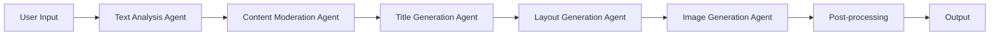

# AI Agent Contracts

**Date**: 2025-12-21
**Purpose**: Define contracts for AI service integrations

## Agent Chain Architecture

```typescript
interface AIAgent {
  id: string;
  name: string;
  type: AgentType;
  provider: AIProvider;
  input: any;
  output: any;
  config: AgentConfig;
}

type AgentType =
  | "text-analysis"
  | "title-generation"
  | "image-generation"
  | "layout-generation"
  | "content-moderation";
```

## 1. Text Analysis Agent

Analyzes input text and extracts key information.

### Input Contract
```typescript
interface TextAnalysisInput {
  text: string;
  contentType: "title" | "paragraph" | "article" | "blog";
  maxLength?: number;
  language?: string;
}
```

### Output Contract
```typescript
interface TextAnalysisOutput {
  extractedTitle: string;
  keyPoints: string[];
  summary: string;
  tags: string[];
  sentiment: "positive" | "neutral" | "negative";
  topic: string;
  readingTime: number; // in minutes
  wordCount: number;
}
```

### Provider Implementations
- **OpenAI**: GPT-4 with structured output
- **Gemini**: gemini-pro with JSON mode
- **Qwen**: qwen-plus with function calling

## 2. Title Generation Agent

Generates optimized titles for different platforms.

### Input Contract
```typescript
interface TitleGenerationInput {
  originalText: string;
  analysis: TextAnalysisOutput;
  platform: "xiaohongshu" | "wechat" | "product";
  style: string;
  maxLength: number;
  targetAudience?: string;
}
```

### Output Contract
```typescript
interface TitleGenerationOutput {
  titles: {
    primary: string;
    alternatives: string[];
  };
  hooks: string[]; // Clickbait hooks
  hashtags: string[];
  emoji: string[];
  seoScore: number; // 0-100
}
```

### Provider Implementations
- **OpenAI**: GPT-4 with platform-specific prompts
- **Gemini**: gemini-pro with title optimization
- **Custom**: Rule-based title optimization

## 3. Image Generation Agent

Generates cover images based on text content.

### Input Contract
```typescript
interface ImageGenerationInput {
  title: string;
  keyPoints: string[];
  style: string;
  platform: string;
  aspectRatio: string;
  colorPalette?: string[];
  mood?: string;
  composition?: string;
}
```

### Output Contract
```typescript
interface ImageGenerationOutput {
  imageUrl: string;
  thumbnailUrl?: string;
  metadata: {
    model: string;
    prompt: string;
    seed?: number;
    steps: number;
    cfgScale: number;
  };
  alternatives?: string[]; // Alternative images
}
```

### Provider Implementations
- **Nano Banana Pro**: High-quality professional images
- **Qwen**: qwen-vl-max for Chinese content
- **豆包**: Doubao-image for artistic styles
- **Replicate**: Stable Diffusion for custom styles
- **OpenAI**: DALL-E 3 for creative concepts

## 4. Layout Generation Agent

Generates layout templates for text placement.

### Input Contract
```typescript
interface LayoutGenerationInput {
  title: string;
  subtitle?: string;
  keyPoints?: string[];
  platform: string;
  style: string;
  elements: LayoutElement[];
}
```

### Output Contract
```typescript
interface LayoutGenerationOutput {
  layout: {
    elements: PositionedElement[];
    composition: string;
    balance: number; // 0-100
  };
  svgTemplate?: string; // SVG template for rendering
}
```

### Provider Implementations
- **Custom**: Rule-based layout engine
- **OpenAI**: GPT-4 for layout suggestions
- **Template-based**: Predefined layout library

## 5. Content Moderation Agent

Checks content for policy violations.

### Input Contract
```typescript
interface ModerationInput {
  text: string;
  imageUrl?: string;
  platform: string;
  category: "text" | "image" | "both";
}
```

### Output Contract
```typescript
interface ModerationOutput {
  approved: boolean;
  categories: {
    violence: number; // 0-1
    sexual: number; // 0-1
    hate: number; // 0-1
    selfHarm: number; // 0-1
    illegal: number; // 0-1
  };
  flaggedContent?: string[];
  suggestions?: string[];
}
```

### Provider Implementations
- **OpenAI**: Moderation API
- **Azure**: Content Moderator
- **Custom**: Keyword-based filtering

## Agent Chain Flow



## Error Handling

### Standard Error Response
```typescript
interface AgentError {
  agent: string;
  provider: string;
  code: string;
  message: string;
  retryable: boolean;
  fallback?: {
    provider: string;
    reason: string;
  };
}
```

### Fallback Strategy
1. Primary provider failure → Try backup provider
2. All providers failed → Return graceful error message
3. Timeout → Use cached result if available
4. Rate limit → Queue request for later processing

## Performance Optimization

### Caching Strategy
- Text analysis: Cache by hash (TTL: 1 hour)
- Generated titles: Cache by text hash + platform (TTL: 24 hours)
- Image generation: Cache by prompt hash (TTL: 7 days)
- Templates: Persistent cache

### Parallel Processing
```typescript
// Generate for multiple platforms in parallel
const results = await Promise.allSettled(
  platforms.map(platform =>
    generateForPlatform(content, platform, style)
  )
);
```

### Streaming
- Stream AI responses for real-time progress
- Stream image generation progress
- WebSocket for live updates

## Integration Points

### LangChain.js Integration
```typescript
import { ChatOpenAI } from "@langchain/openai";
import { PromptTemplate } from "@langchain/core/prompts";
import { StructuredOutputParser } from "langchain/output_parsers";

// Create agent with LangChain
const createAgent = (provider: AIProvider, template: string) => {
  const model = new ChatOpenAI({
    temperature: 0.7,
    modelName: provider.model,
    openAIApiKey: provider.apiKey,
  });

  const prompt = PromptTemplate.fromTemplate(template);
  const parser = StructuredOutputParser.fromNamesAndDescriptions({
    title: "Generated title",
    keyPoints: "Array of key points",
  });

  return new LLMChain({
    llm: model,
    prompt: prompt,
    outputParser: parser,
  });
};
```

### Edge Runtime Compatibility
- Use `@ai-sdk/openai/edge` for Edge functions
- Implement retry logic with exponential backoff
- Handle streaming responses properly